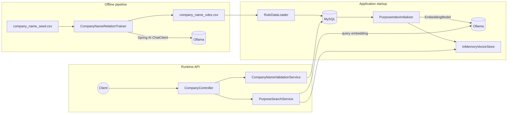

# sample-spring-ai

Spring Boot application that uses **Spring AI** with **Ollama** for embeddings and chat, **MySQL** for persistence, and an **in-memory vector index** for semantic search. It provides company-name validation driven by offline-trained rules and similarity search over business purposes.

## Features

- **Semantic purpose search** — embeddings stored in MySQL, searched in memory via cosine similarity
- **Company name validation** — format checks plus data-driven rules keyed by `industry_id` and `business_type`
- **Offline rule training** — LLM classifies seed rows into a versioned CSV, imported incrementally on startup

## Architecture



### Data model

| Table | Role |
|-------|------|
| `business_purpose` | Purpose text and embedding (JSON); source of truth for the vector index |
| `company_name_rule` | Trained `(industry_id, business_type, company_name, relation)` rows |
| `data_version` | Tracks which CSV versions have been imported |

Schema: `src/main/resources/schema.sql` (applied on startup).

## Stack

| Component | Technology |
|-----------|------------|
| Runtime | Kotlin, Spring Boot 3.4, JVM 21 |
| AI | Spring AI 1.0 — `EmbeddingModel`, `ChatClient` |
| Models | Ollama — `nomic-embed-text`, `llama3.2` |
| Database | MySQL 8, JDBC |
| Vector search | In-memory cosine similarity |

## Quick start

**Prerequisites:** Docker, Docker Compose

```bash
docker compose up -d
docker exec ollama ollama pull nomic-embed-text
docker exec ollama ollama pull llama3.2
./gradlew bootRun
```

The app listens on `http://localhost:8080`. On first boot it creates the schema, seeds sample purposes, computes embeddings, loads the in-memory index, and imports `data/company_name_rules.csv`.

**Testcontainers (optional):** `./gradlew bootTestRun` — no manual `docker compose` required.

## API

| Method | Path | Description |
|--------|------|-------------|
| `POST` | `/api/validate-name` | Validate name against format rules and trained industry/business-type data |
| `POST` | `/api/search-purpose` | Semantic search over business purposes |
| `POST` | `/api/purposes` | Add a purpose (MySQL + in-memory index) |

Example requests live in [`http/api.http`](http/api.http). See [`doc/API_TESTING.md`](doc/API_TESTING.md) for request/response details and [`doc/TUNING_SUMMARY.txt`](doc/TUNING_SUMMARY.txt) for `topK` / `threshold` tuning.

## Offline rule training

```bash
./gradlew bootRun --args="--app.training.enabled=true"
```

Reads `data/company_name_seed.csv`, classifies each row via Ollama, appends results to `data/company_name_rules.csv` as a new `data_version`, then exits. The next normal startup imports only new versions.

## Configuration

Key settings in `application.yml`:

| Property | Default | Description |
|----------|---------|-------------|
| `app.search.default-top-k` | `5` | Default result limit for search |
| `app.search.default-threshold` | `0.5` | Minimum cosine similarity (0–1) |
| `app.rule.csv-path` | `data/company_name_rules.csv` | Trained rules CSV |
| `app.training.enabled` | `false` | Enable offline trainer on startup |

## Project layout

```
src/main/kotlin/.../startup/     RuleDataLoader, PurposeIndexInitializer
src/main/kotlin/.../training/    CompanyNameRelationTrainer (offline)
src/main/kotlin/.../vectorstore/ InMemoryVectorStore
data/                            Seed and trained CSV files
http/api.http                    IDE HTTP client examples
doc/                             API testing and tuning guides
```
