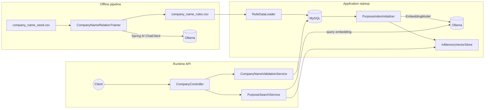

# Purpose Guard

**Local-first Spring AI starter:** semantic business-purpose search (MySQL + in-memory vectors) and industry-aware company name validation (offline LLM rules → CSV → MySQL).

[](https://github.com/phuongnguyen0793/spring-ai-purpose-guard/actions/workflows/ci.yml)


> **Why this exists:** Spring AI + Ollama without OpenSearch or Pinecone — embeddings live in MySQL, cosine search runs in memory. Company-name rules are trained offline via LLM and imported from versioned CSV.

## Demo

Validate a Japanese IT company name, then run semantic purpose search — all local with Ollama:

```bash
./scripts/demo.sh
```

Or copy-paste after `./gradlew bootRun`:

```bash
# Validate name against trained IT/software rules
curl -s -X POST http://localhost:8080/api/validate-name \
  -H "Content-Type: application/json" \
  -d '{"companyName":"株式会社テックソリューション","industryId":"IT","businessType":"software"}'

# Semantic search over business purposes
curl -s -X POST http://localhost:8080/api/search-purpose \
  -H "Content-Type: application/json" \
  -d '{"purpose":"AI healthcare diagnostics"}'
```

More requests: [`http/api.http`](http/api.http) · [`doc/API_TESTING.md`](doc/API_TESTING.md)

## Features

- **Semantic purpose search** — embeddings stored in MySQL, searched in memory via cosine similarity
- **Company name validation** — format checks plus data-driven rules keyed by `industry_id` and `business_type`
- **Offline rule training** — LLM classifies seed rows into a versioned CSV, imported incrementally on startup

## Architecture



### Data model

| Table | Role |
|-------|------|
| `business_purpose` | Purpose text and embedding (JSON); source of truth for the vector index |
| `company_name_rule` | Trained `(industry_id, business_type, company_name, relation)` rows |
| `data_version` | Tracks which CSV versions have been imported |

Schema: `src/main/resources/schema.sql` (applied on startup).

## Stack

| Component | Technology |
|-----------|------------|
| Runtime | Kotlin, Spring Boot 3.4, JVM 21 |
| AI | Spring AI 1.0 — `EmbeddingModel`, `ChatClient` |
| Models | Ollama — `nomic-embed-text`, `llama3.2` |
| Database | MySQL 8, JDBC |
| Vector search | In-memory cosine similarity |

## Quick start

**Prerequisites:** Docker, Docker Compose

```bash
docker compose up -d
./gradlew bootRun
```

On first boot the app creates the schema, seeds sample purposes, computes embeddings, loads the in-memory index, and imports `data/company_name_rules.csv`. Pull Ollama models first if needed:

```bash
docker exec ollama ollama pull nomic-embed-text
docker exec ollama ollama pull llama3.2
```

The app listens on `http://localhost:8080`.

**Testcontainers (optional):** `./gradlew bootTestRun` — no manual `docker compose` required.

## API

| Method | Path | Description |
|--------|------|-------------|
| `POST` | `/api/validate-name` | Validate name against format rules and trained industry/business-type data |
| `POST` | `/api/search-purpose` | Semantic search over business purposes |
| `POST` | `/api/purposes` | Add a purpose (MySQL + in-memory index) |

See [`doc/TUNING_SUMMARY.txt`](doc/TUNING_SUMMARY.txt) for `topK` / `threshold` tuning.

## Offline rule training

```bash
./gradlew bootRun --args="--app.training.enabled=true"
```

Reads `data/company_name_seed.csv`, classifies each row via Ollama, appends results to `data/company_name_rules.csv` as a new `data_version`, then exits. The next normal startup imports only new versions.

## Configuration

Key settings in `application.yml`:

| Property | Default | Description |
|----------|---------|-------------|
| `app.search.default-top-k` | `5` | Default result limit for search |
| `app.search.default-threshold` | `0.5` | Minimum cosine similarity (0–1) |
| `app.rule.csv-path` | `data/company_name_rules.csv` | Trained rules CSV |
| `app.training.enabled` | `false` | Enable offline trainer on startup |

## Project layout

```
src/main/kotlin/.../startup/     RuleDataLoader, PurposeIndexInitializer
src/main/kotlin/.../training/    CompanyNameRelationTrainer (offline)
src/main/kotlin/.../vectorstore/ InMemoryVectorStore
scripts/demo.sh                  One-command validate + search demo
data/                            Seed and trained CSV files
http/api.http                    IDE HTTP client examples
doc/                             API testing and tuning guides
```

## GitHub topics

Suggested topics for repository settings: `spring-ai`, `ollama`, `kotlin`, `spring-boot`, `vector-search`, `embeddings`, `mysql`, `testcontainers`, `semantic-search`, `japanese`

## License

[MIT](LICENSE)
